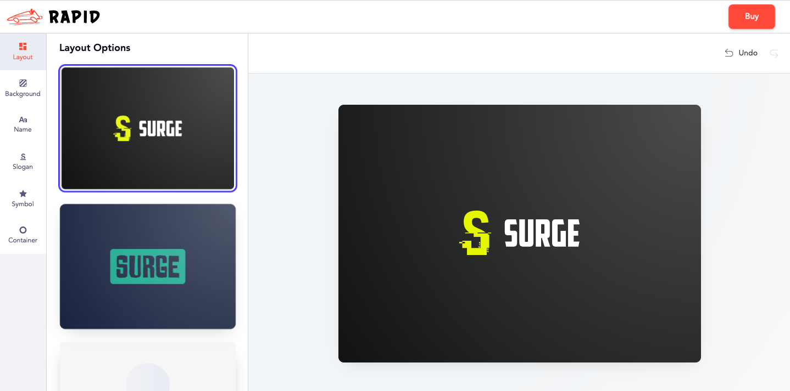

# White Label Overview
In this section we'll give you a high level summary of the white label. We'll describe how businesses are using it to earn revenue, unblock their customers, and earn brand loyalty. Then, we'll give you some next steps if you want to learn more and try it out.

Before we get to that, if you don't want to read anything and just want to test out integrating the white label in your app, you can go to the [tutorial section](./tutorial) to get up and running in about 10 minutes.

### What is a white label logo maker?

A white label logo maker is when you run Looka's best-in-class logo maker on your site, with your branding. This allows you to offer your customers better service and increase brand loyalty at a fraction of the cost of developing the logo maker yourself. At Looka, we've invested millions of dollars into our logo maker since we launched in 2016. We're proud of it, too. We're the best ranked logo maker on Trustpilot with over 9,000 reviews. We run a profitable business, and we're passionate about continuing to improve our logo maker to maintain our best-in-class status. Through white labelling, you can benefit from all the lessons we've learned and the development we've done.

### Who is a good white label partner?

Despite the benefits of white labelling, it isn't for everyone. A lot of our partners thrive as [affiliate partners](https://looka.com/affiliate-program). An affiliate partnership might be right for you if your site traffic is less than 1,000 unique visitors per month. There are always exceptions, however. If you're not sure whether affiliate or white labelling is right for you, please reach out to <a href="mailto:partnerships@looka.com">partnerships@looka.com</a>.

#### Some examples of white label customers

* Website builder
* Domain host
* Small business service provider
* No-code platform
* Automated design service
* Agencies
 

### Why do companies white label?

White labelling allows companies to make additional revenue, increase brand loyalty, and differentiate themselves from their competitors - all with low upfront costs and low maintenance costs. This can be very successful - for example, our top partner in 2020 made over $500,000 USD in profit by working with Looka.

### How does white labelling work

We’ve designed the white label to be as easy to set up as possible. You can even try out an integration before talking to us. See the [tutorial](./tutorial) and [technical description](./technical) for more.

In short, you integrate the white label as a script in your app. For instance, you might have a button called "logo maker", and when the user clicks that button they're taken to your white label version of the logo maker. From there, the user can access all the features of Looka's logo maker. When they're happy with their logo, they're redirected back to your app to make the purchase.

To simplify your set up of the white label, there are a few key points:

* **The white label doesn’t store data about your users.** You pass us a user identifier and that's all we know about them.
* **The white label doesn’t process payment.** If you're looking to sell logos directly to your customers, you can use their existing payments system to handle payments without having to worry about integrating with another system. If you prefer for Looka to process the payments, then an [affiliate partnership](https://looka.com/affiliate-program) might be a better fit.
* **You can test out integrating it today.** In these docs we provide a test token that will allow you to try out your integration. Once you’re happy with it, you can register your white label. See the [tutorial](./tutorial).
* **Lots of configuration options.** White label configuration is handled by a JSON file that we load once you’ve registered your white label. You can configure your colors, typefaces, logo, and more.

### What's next?
From here, you can look at our [FAQ](./faq), check out our [pricing plans](./pricing), or try out an [integration](./tutorial). If you have any questions we're here for you at <a href="mailto:partnerships@looka.com">partnerships@looka.com</a>.

